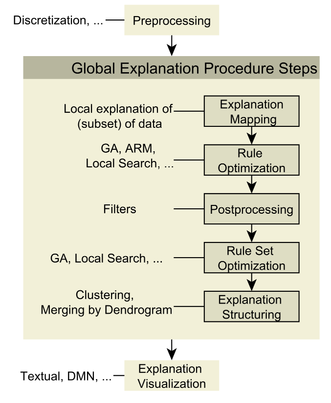
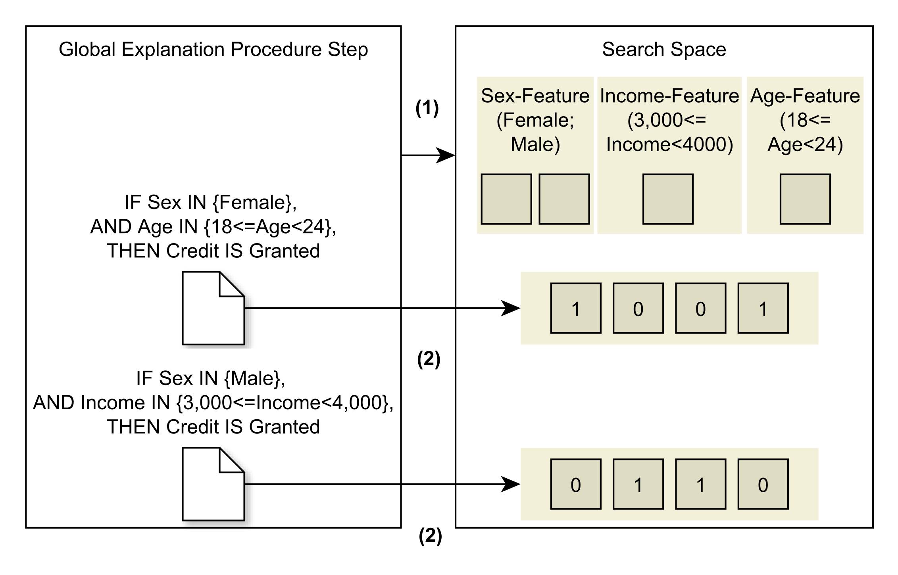

# Model Agnostic Globally Interpretable Explanations (MAGIE, German for "magic")
[](https://opensource.org/licenses/BSD-3-Clause)

This project comprises a framework for recombining different steps which generate rule-based global explanations for any black box supervised learning model. For a given model, rules in the format ```IF <conditions> THEN <class-label>``` are created, striving to describe the supervised learning model's behavior as precise, yet, as general as possible.
It utilizes [*Roaring Bitmaps*](http://www.roaringbitmap.org/) to efficiently evaluate different optimization and filtering steps, and features a [Java-*Anchors*-implementation](https://github.com/viadee/javaAnchorExplainer) to optionally create local explanations.


# Getting Started

Several examples on how to actually start an explanation pipeline, multiple of which are predefined in the ```exemplary_pipeline```-subpackage of the ```explanation_pipeline```-package, are given in the ```validation```-package. The ```AdultValidation```-class implements a template to evaluate the procedure on the [adult-dataset](https://archive.ics.uci.edu/ml/datasets/Adult).
```
public static void main(String[] args) {
    AnchorTabular anchorTabular = null;

    try {
        anchorTabular = new AnchorTabular.Builder()
                .setDoBalance(false)
                .addColumn(DoubleColumn.fromStringInput("age"))
                .addColumn(new StringColumn("workclass"))
                .addIgnoredColumn(DoubleColumn.fromStringInput("fnlwgt"))
                .addColumn(new StringColumn("education"))
                .addIgnoredColumn(IntegerColumn.fromStringInput("education-num"))
                .addColumn(new StringColumn("marital-status"))
                .addColumn(new StringColumn("occupation"))
                .addColumn(new StringColumn("relationship"))
                .addColumn(new StringColumn("race"))
                .addColumn(new StringColumn("sex"))
                .addIgnoredColumn(DoubleColumn.fromStringInput("capital-gain"))
                .addIgnoredColumn(DoubleColumn.fromStringInput("capital-loss"))
                .addColumn(DoubleColumn.fromStringInput("hours-per-week"))
                .addColumn(new StringColumn("native-country"))
                .addTargetColumn(new StringColumn("wage"))
                .build(ClassLoader.getSystemResourceAsStream("adult.data"), true, true);
    } catch (Exception e) {
        e.printStackTrace();
    }
    NullDataAdapter dataAdapter = new NullDataAdapter(anchorTabular);
    // Can be exchanged for any other pipeline of the exemplary_pipeline-package.
    AbstractStdExplanationPipeline working = new DirectMemeticMining(dataAdapter, "Adult");
    System.out.println(working.executePipeline().getVisualizedResult());
}
```
The major effort here is to create the ```AnchorTabular```-instance so that the ```NullDataAdapter``` can use it to load the dataset. Calling ```ExplanationPipeline.executePipeline()``` starts the defined pipeline and returns the result, i.e., multiple rules are being displayed for each class label. 
In the following, the creation-process of new pipelines and the coarse meaning of different components during their specification is outlined. 

To create and utilize a pipeline, a specialization of ```ExplanationPipeline``` must be created. For a more detailed discussion, see "An Introduction into the Framework".
First, a constructor must be specified. It should be noted that multiple convenience features of the software package are work-in-progress (see "Work-in-progress"-subsection). Hence, the most important attributes are focussed upon, namely the ```dataSourceAdapter```, ```blackBoxClassifierAdapter```, and the ```localExplainer```. 

The exemplary pipeline ```DirectMemeticMining``` is explained in more detail:
```DirectMemeticMining``` is a subclass of ```AbstractStdExplanationPipeline```. While ```AbstractStdExplanationPipeline``` implements the preparation of the dataset for several exemplary pipelines, ```DirectMemeticMining``` implements the ```addSteps()```-method.
```
public DirectMemeticMining(NullDataAdapter nullDataAdapter, String datasetName) {
    super(
        nullDataAdapter,
        new TRSmileRFClassifier(),
        null,
        "DirectMemeticMining_" + datasetName
    );
}
```
The constructor of ```DirectMemeticMining``` demands the specification of a data adapter. For this implementation the ```NullDataAdapter``` was chosen. The ```NullDataAdapter``` simply utilizes an ```AnchorTabular``` to load the dataset. ```AnchorTabular``` is the data class which is also used in the Java-*Anchors*-implementation and was chosen for compatibility reasons. 
The ```TRSmileRFClassifier``` is the black box adapter. It wraps the random forest-implementation of the [Smile](http://haifengl.github.io/smile/)-library and supplies functionality to train and predict data points for the chosen data structures. 
```DirectMemeticMining``` does not use a explanation mapping-step, hence, does not need to specify a local explainer, such as Anchors. Therefore, ```null``` is specified instead. The String ```"DirectMemeticMining_" + datasetName``` simply is used for the dummy-persistence service (WIP) which stores all generated explanations in a text file. 

Another crucial building block is the ```addSteps()```-method. In this method the algorithmic steps for the explanation procedure are specified: 
```
protected void addSteps() {
    this.addRuleOptimizer(new RuleExplanationGeneticAlgorithm(0.05, 120), true)
        .addRuleOptimizer(new KOptimalRuleExplanationOptimizer(0.01, 1), true)
        .addWithTest(new BaselineRuleExplanationFilter(), true)
        .add(new RuleSetEnhancementFilter(), true)
        .add(new PairwiseRuleExplanationMetricFilter(), true)
        .add(new ObsoleteDisjunctionFilter(), false)
    ;
}
```
The builder-pattern is used to sequentially add processing steps which, with the exception of the ```ExplanationMapper``` and the ```ExplanationStructurer```, are executed per-label in the specified order. 
First, the ```DirectMemeticMining```-pipeline executes a genetic algorithm with a certain parametrization. The genetic algorithm initializes a set of rule explanations and optimizes them according to its default objective function. Several more parameters can be set here. The "true"-argument for the add-method denotes that the result of this intermediate step should be persisted.
After this optimization, a refining k-optimal local search is conducted for each of the rules output by the genetic algorithm.
Subsequently to these two optimizers, for each of the created rules it is evaluated on a test-dataset, i.e., a dataset which was not used to train the black box model, whether their precision surpasses the baseline precision for the current label value. 
The remaining rules then are compared with each other in a pairwise-manner, keeping only the "best", according to a defineable metric, rules. Lastly, obsolete conditions of a rule are discarded. 

In this manner, different types of explanation steps can be added in a specified order dynamically.

## An Introduction into the Framework
The framework is the result of analyzing multiple state-of-the-art rule-based explanation approaches. 
Five different steps have been identified. These steps form pipelines of varying shape representing different global explanation approaches. 
The sequence of steps is combined in so-called ```ExplanationPipeline```s. 
These pipelines, alongside with the steps, are explained here.

### Explanation Pipelines and Data Preprocessing
An ```ExplanationPipeline``` is a template which defines different steps for creating sets of rule-based explanations. 
Exemplary (hierarchies of) pipelines can be found in the ```explanation_pipeline```-package. Currently, the standard template is the ```ExplanationPipeline```. 
Specializations of the ```ExplanationPipeline``` template must implement the two abstract methods ```prepareDataset(AnchorTabular anchorTabular)``` and ```addSteps()```.

In the ```prepareDataset(AnchorTabular anchorTabular)```-method, the dataset is loaded and preprocessing steps are conducted. The exemplary abstract specialization ```AbstractStdExplanationPipeline``` is an example for this: The AnchorTabular (see the related [*AnchorExplainer*-project](https://github.com/viadee/javaAnchorExplainer)) is used to load a dataset with a categorical label. A training-test-split is conducted, i.e., the training-dataset is used to train the black box model and create rules. The test split can optionally be used to evaluate the generalization capability *of the rules*. It is expected, that the generalization capability of the black box model, in terms of cross-validation or related approaches, is evaluated separately from this framework. Furthermore, a ```PercentileDiscretizer``` is applied so that continuous variables are discretized. In this case, discretization is only conducted for the explanation procedure, not for the black box model. A black box model, which is to be analyzed, is passed.
```
protected void prepareDataset(AnchorTabular anchorTabular) {
    TabularDataset.TabularDatasetBuilder<?, CategoricalLabelColumn, CategoricalLabelColumn> builder = TabularDataset
            .newBuilderWithAnchorTabular(
                    CategoricalLabelColumn.class,
                    CategoricalLabelColumn.class,
                    CategoricalLabelColumn.class,
                    anchorTabular)
            .withTrainingTestSplit(true, 0.2, 42)
            .withExplainerDataDiscretizer(new PercentileDiscretizer<>(new int[] {17, 33, 50, 67, 83}))
            .withBlackBoxModel(blackBoxClassifierAdapter);
    dataset = builder.buildTrainingData();
    testData = builder.buildTestData();
}
```
While the built dataset is used for the black box model, an index is also built on it. [*Roaring Bitmaps*](http://www.roaringbitmap.org/) are created to enable the fast generation of explanations.

This ```prepareDataset(AnchorTabular anchorTabular)``` can be used to define preprocessing steps for both model-training as well as for the explanation procedure, the ```addSteps()```-method is responsible for defining how the explanation procedure should behave.
More concrete examples can be found in the ```exemplary_pipeline```-subpackage, such as the ```ReorderedKOptMAGIX```-pipeline: 
```
protected void addSteps() {
    this.add(new ModifiedMAGIXExplanationMapper(), true)
            .addRuleOptimizer(new RuleExplanationGeneticAlgorithm(), true)
            .addRuleOptimizer(new KOptimalRuleExplanationOptimizer(0.0001, 1), true)
            .addWithTest(new BaselineRuleExplanationFilter(), true)
            .add(new RuleSetEnhancementFilter(), true)
            .add(new PairwiseRuleExplanationMetricFilter(), true)
            .add(new ObsoleteDisjunctionFilter(), false)
    ;
}
```
Noticeably, in the ```addSteps()```-method, several forms of ```addXYZ(...)``` and ```addXYZWithTest(...)``` are called. These add-invocations directly correspond to adding a new processing step to the pipeline. Computing these processing steps either uses the training data or the test data. They are described in the following. 
Each kind of step is located in its own subpackage within the ```global_explanation_procedure_step```-package. The structure of an exemplary pipeline is given in the following:



While the order of rule optimizers, rule set optimizers, and filters can in fact vary, the explanation mapper and the explanation structurer are fixed as the first and last step correspondingly. 
All of these steps are executed for each *individual* label, i.e., for each possible class value, in separation. That means that all steps are executed as many times as there are label values in the dataset. This ensures that descriptive rules are created for all labels and no single label dominates in generated explanations.

### Explanation Mapping

The explanation mapping-step corresponds to the initial creation of local explanations. In the ```ModifiedMAGIXExplanationMapper```-implementation (denoted as such to acknowledge the contribution of [*MAGIX*](https://arxiv.org/abs/1706.07160) to the implementation), the [Java-*Anchors*-implementation](https://github.com/viadee/javaAnchorExplainer) is utilized to create a certain amount of local explanations. These local explanations then can be used as building blocks to create a *global* explanation. The term "explanation mapping" hence denotes the mapping of local explanations into the domain of global explanations. The framework can utilize these explanations to initialize optimization procedures and serve them as the search space for discovering further rules. 
If no local explainer is specified, the ```AllConditionsMapper``` effectively skips the creation of local explanations: A single pseudo-explanation is generated which contains all possible conditions for a rule's antecedent. The ```AllConditionsMapper``` is added automatically, if no other ```ExplanationMapper``` is specified.

### Optimization

There are two types of rule-explanation optimization executable using the framework. First, the optimization of individual rules. Second, the optimization of rule sets. Optimizers are coarsely divided into an initializer, a representation translator, and objective function, and into an optimization procedure. 
The task of the initializer is to accept a forwarded set of rule explanations, e.g. from an explanation mapping step, and initialize a population of rule explanations which are to be optimized. One might simply use the forwarded rules as an initial population or single conditions of the rule's antecedent. 
The representation translator in turn transforms the representation used by the algorithm into a rule explanation (set). By doing so, the same optimization procedure can be used to optimize rule sets and individual rules, simply by providing a new representation translator. 

Currently, a k-optimal local search for rules (```KOptimalRuleExplanationOptimizer```), and a genetic algorithm for optimizing rules or rule sets (subclasses of the ```AbstractGeneticAlgorithm```) are implemented.

#### Rule Optimization

Rule optimizers accept a ```RuleExplanationSet``` as input. If a condition, i.e., a categorical predictor feature's value, exists within one of the rules, it is added to the overall search space of the optimization procedure. This search space then can be explored to find well-performing rules. The objective function should be applicable to evaluate the quality of a rule. Currently, mutual information-based measures are utilized.



#### Rule Set Optimization

Rule set optimizers also accept a ```RuleExplanationSet```. The set of rules rule within the forwarded rule explanation set forms the search space in this case. Rule set optimizers aim is to reduce the number of rules within the given ```RuleExplanationSet``` while maintaining a good coverage and quality of explanation.

### Explanation Postprocessing

"Postprocessing" denotes filtering-steps and changes to rules and rule sets which do not utilize a search mechanism. For example, if two rules cover too many of the same data instances of the dataset, only the "better" one is kept (see ```PairwiseRuleExplanationMetricFilter```). Another example might be the comparison of a rule's metric with some defined baseline, such as the baseline precision (see ```BaselineRuleExplanationFilter```). Lastly, also the contribution of a rule to a priorly created rule set might be evaluated (see ```RuleSetEnhancementFilter```).

### Explanation Structuring

Explanation structuring denotes the preparation of rule sets for displaying them to a user. Aforementioned rule sets are created for each label value in separation. Thus, in the phase of explanation structuring, explanations of different labels might be clustered together. Rule explanations might also be joined in a dendrogram-like fashion ([as is done in other approaches](https://www.kdnuggets.com/2019/03/ai-black-box-explanation-problem.html)).
This type of step has not yet been treated. Hence, especially for this step, the signature and used data structures might be subject to change.

### Explanation Visualization

Lastly, the structured explanations are to be visualized to the user. One might use different solutions such as DMN-tables (see, for example, [here](https://www.omg.org/spec/DMN/About-DMN/)), or simply a text-representation of the created rule (sets).

## Related Projects

+ This framework's implementation features the [Anchors-implementation](https://github.com.viadee/javaAnchorExplainer) as a possible local explainer. Further enhancements can be found in a dedicated project, called [AnchorAdapters](https://github.com/viadee/javaAnchorAdapters).
+ Examples of Anchors' usage can be found in the [XAI Examples](https://github.com/viadee/xai_examples) project. It features a readily compilable Maven project that can be used to skip necessary configuration steps.
+ Anchors has also been released as an [**R package**](https://github.com/viadee/anchorsOnR) and will soon be available on CRAN.


# Collaboration

The project is operated and further developed by the viadee Consulting AG in Münster, Westphalia. Results from a thesis at the WWU Münster have been incorporated.
* Further theses are planned: Contact person is Dr. Frank Köhne from viadee.
    Community contributions to the project are welcome: Please open Github-Issues with suggestions (or PR), which we can then edit in the team.
*   We are looking for further partners who have interesting process data to refine our tooling as well as partners that are simply interested in a discussion about AI in the context of business process automation and explainability.
*	We are looking for new collaborators for this project.

## Work-in-progress

+ The ExplanationStructurer-component should be revised and exemplary implementations should be provided for it. 
+ Utilizing the ```AnchorTabular```-data structure might be too much overhead. Either the ```AnchorTabular```-class should be refactored to be more type-safe, or another initial data loading-mechanism might be proposed.
+ The persistens-feature should be implemented utilizing a database. A suitable schema for this should be created. (Intermediate) Results stored in the database should be useable to continue from.
+ Further preprocessing methods, especially further methods to discretize numerical features, might be implemented.

## Authors

* **Hendrik Winkelmann** - *Initial work* - [NoItAll](https://github.com/NoItAll)

## Acknowledgments

During the creation of this framework, different existing XAI-approaches have been analyzed to derive the aforementioned processing steps. Furthermore, some packages have offered great help during the overall implementation.
+ [*Model Agnostic Globally Interpretable Explanations (MAGIX)*](https://arxiv.org/abs/1706.07160): It was the primary intent of the thesis and the created software package to implement and enhance the concepts of MAGIX. Several steps of the method, described in the paper were generalized, adapted, and the given template was extended. The name "MAGIE" was chosen for the framework to acknowledge the major impact MAGIX had on the overall software package.
+ [*Black Box Explanations through Transparent Approximations (BETA)*](https://arxiv.org/abs/1707.01154): The rule set-optimization step and objective function were adapted. The idea of not necessarily demanding a local explanation procedure is inspired from BETA.
+ [*Bottom-Up Dendrograms* (in lack of a better name)](https://arxiv.org/abs/1806.09936): The explanation structuring-step and the idea of clustering rules were inspired from the authors. The authors furthermore suggest to iteratively merge rules in a dendrogram-like fashion. 
+ [*jenetics*](http://jenetics.io/): The flexible, reconfigurable use of a genetic algorithm facilitated experimentation vastly and may lead to more research of the special case of the no-free-lunch-problem posed by explanations via rules.
+ [*Roaring Bitmaps-index structure*](https://github.com/lemire/RoaringBitmap/): The fast evaluation of rule explanations is mainly due to the fast index structure roaring bitmaps offered. This enabled the implementation of computationally highly complex methods such as the k-optimal local search for *each* rule explanation.